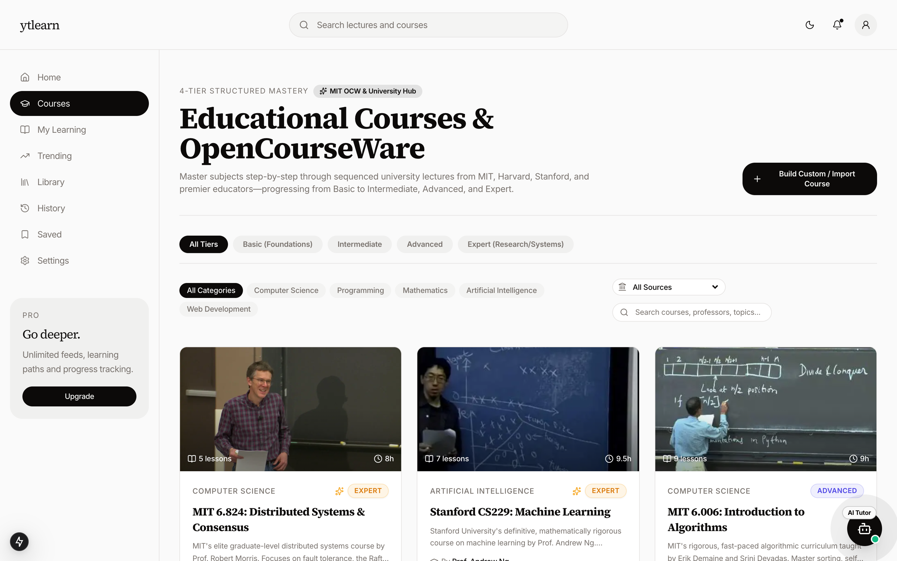
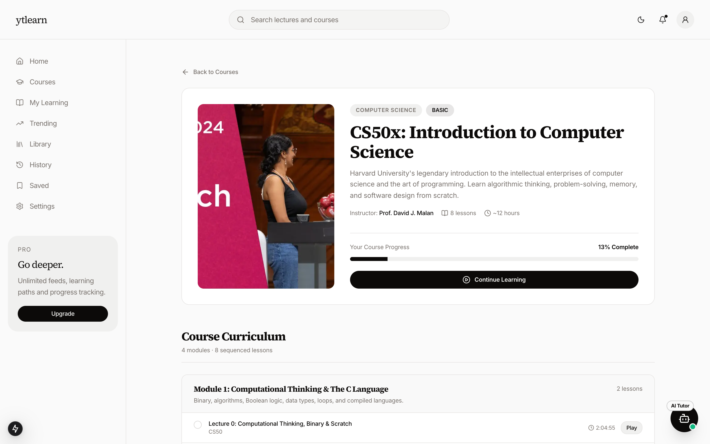
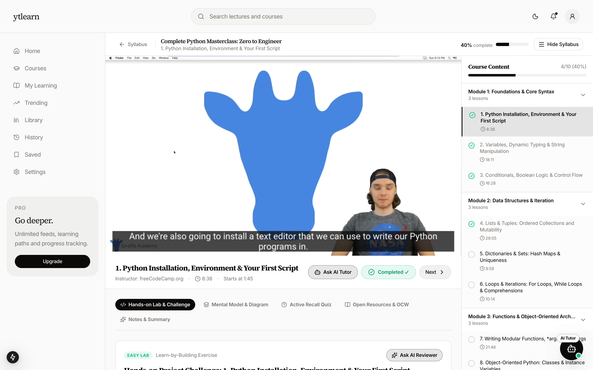
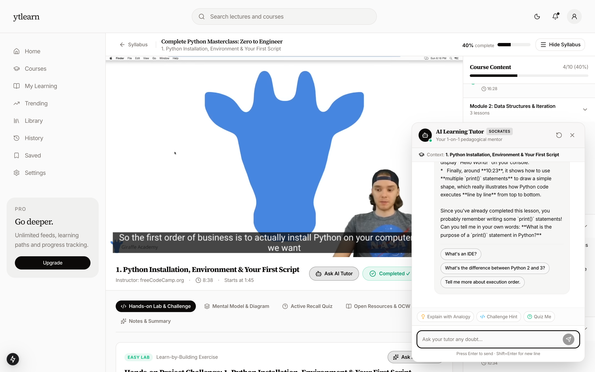

# YouTube Learn

[](https://github.com/Aditya-galaxy/youtube-learn/actions/workflows/ci.yml)
[](LICENSE)
[](https://nextjs.org)

**[Live on Cloud Run →](https://youtube-learn-761390104675.us-east4.run.app)**

Type a topic and get a real course built from YouTube: modules and lessons in a defensible
teaching order, each backed by a lecture that actually plays, with an AI tutor sitting
alongside every lesson. It also ships a curated catalogue including Harvard CS50, MIT 18.06,
MIT 6.006, MIT 6.824 and Stanford CS229, plus the original Education-category video feed.

Built with Next.js 15 (App Router + a small Pages-Router API surface), React 19, TypeScript,
Tailwind, shadcn/ui, NextAuth and Prisma/PostgreSQL, with Gemini on Vertex AI for course
generation and tutoring. It runs on Cloud Run against Cloud SQL in Google Cloud.

## How it works

**Pick a course, or build one from a topic.** The catalogue carries Harvard CS50, MIT 18.06, 6.006 and 6.824, and Stanford CS229 alongside generated courses, filtered by tier and source.



**Each course is a sequence, not a playlist.** Modules and lessons in teaching order, with your progress against them.



**Lessons play the relevant part of a lecture.** Long recordings are sliced on their own chapter markers, so a lesson on installing Python starts at 1:45 and ends nine minutes later instead of dropping you into a four-hour video. Under the player: a hands-on challenge, a mental model diagram, a recall quiz, further reading and your notes.



**A tutor that has watched the lecture.** It opens each lesson with what to listen for and the question it will ask afterwards, answers doubts in context, and can jump the video to a section. Its timestamps come from an outline built by watching the recording — anything it cannot support is stripped before you see it.



## Features

- **Course generation.** A topic becomes a syllabus, then real lessons: the model plans the
  curriculum, retrieval finds candidate lectures, and selection happens by index into that
  candidate pool, so a video id can never be invented. Long lectures are sliced into lessons
  on their own chapter markers. Runs as a resumable background job with live progress.
- **An AI tutor that drives the lesson.** It reads where you are from your account — course,
  module, position, what you have finished — opens each lesson with what to listen for and
  the question it will ask afterwards, corrects wrong answers instead of flattering them,
  and can act: replay the segment, open the challenge or quiz, mark the lesson done, move on.
  It is told plainly that it has not watched the video, so it never invents timestamps.
- **Open courseware catalogue** from Harvard, MIT and Stanford. Every lesson video is checked
  against the YouTube API for existence and embeddability (`npm run verify:videos`).
- **Practice per lesson:** hands-on challenges, active-recall quizzes, diagrams and notes.
- **Progress on your account:** enrolments, completion and notes follow you across devices,
  with the completion percentage always recomputed server-side.
- **Google sign-in** via NextAuth with a Prisma adapter and JWT sessions.
- **Educational feed** from the YouTube Data API, filtered to the Education category and to
  videos that are embeddable, long enough to be substantive, and not obviously clickbait.
- **Search** with results driven entirely by the URL, so a result page can be shared and reloaded.
- **Infinite scroll** using YouTube page tokens.
- **Library / Saved / History**, persisted per-browser in `localStorage`.
- **Per-user rate limiting** on the API so a single account cannot burn the project's daily
  YouTube quota, plus a **project-wide daily quota guard** that pauses course building at 80%
  of the day's YouTube units so the feed keeps working.
- **Light and dark themes.**
- Signed-out visitors get a local sample feed instead of an error.

## Getting started

### Prerequisites

- Node.js 18.18 or newer
- A PostgreSQL database
- A Google Cloud project with the **YouTube Data API v3** enabled and an OAuth 2.0 client

### Setup

```bash
git clone https://github.com/Aditya-galaxy/youtube-learn.git
cd youtube-learn
npm install
cp .env.example .env.local
```

Fill in `.env.local` — every variable is documented in [`.env.example`](.env.example). In the
Google Cloud console, add `http://localhost:3000/api/auth/callback/google` as an authorised
redirect URI.

Push the Prisma schema to your database:

```bash
npx prisma db push
```

Then start the dev server:

```bash
npm run dev
```

The app runs at http://localhost:3000.

### Scripts

| Command             | Description                                         |
| ------------------- | --------------------------------------------------- |
| `npm run dev`       | Start the development server                        |
| `npm run build`     | Generate the Prisma client and build for production |
| `npm start`         | Serve the production build                          |
| `npm run lint`      | Run ESLint                                          |
| `npm run typecheck` | Run `tsc --noEmit`                                  |

## Environment variables

| Variable               | Required | Purpose                                            |
| ---------------------- | -------- | -------------------------------------------------- |
| `DATABASE_URL`         | yes      | Pooled PostgreSQL connection used at runtime       |
| `DIRECT_URL`           | yes      | Unpooled connection used by Prisma migrations      |
| `NEXTAUTH_URL`         | yes      | Canonical URL of the deployment                    |
| `NEXTAUTH_SECRET`      | yes      | Session encryption key (`openssl rand -base64 32`) |
| `GOOGLE_CLIENT_ID`     | yes      | Google OAuth client ID                             |
| `GOOGLE_CLIENT_SECRET` | yes      | Google OAuth client secret                         |
| `YOUTUBE_API_KEY`      | yes      | Server-side YouTube Data API v3 key                |
| `GEMINI_API_KEY`       | yes      | Used to generate course curricula and lesson notes |
| `GEMINI_MODEL`         | no       | Overrides the default Gemini model id              |

## Project structure

```
src/
  app/                 App Router pages, layout, and the /api/user-logs route
  pages/api/           NextAuth handler and the YouTube feed endpoint
  components/          UI, grouped by feature; components/ui is shadcn/ui
  Helper/Context.tsx   Client state: selected video, library, saved, history
  lib/                 auth options, Prisma client, formatters, sample feed
  config/navigation.ts Nav items shared by the sidebar and mobile sheet
prisma/schema.prisma   User, Account, Session, UserTokens, ViewedVideos
```

## Database

Postgres via Prisma migrations in `prisma/migrations/`:

- `0_init` — the auth tables every existing deployment already has.
- `1_courses_and_generation` — courses, modules, lessons, enrollments and
  generation jobs.

**Fresh database:** `npm run db:migrate`.

**A database created earlier with `prisma db push`** has the auth tables but no
migration history, so `migrate deploy` stops with P3005. Mark the baseline as
applied once, then deploy:

```bash
npx prisma migrate resolve --applied 0_init
npm run db:migrate
```

`db:migrate` is deliberately not part of `build`: running it against an
un-baselined database would fail the deploy.

**Production runs on Cloud SQL for PostgreSQL** (`kronagent:us-east4:youtube-learn-pg`).
Connect from a workstation through the Cloud SQL Auth Proxy, which authenticates
with IAM rather than an IP allowlist:

```bash
cloud-sql-proxy --port 5434 --quota-project kronagent kronagent:us-east4:youtube-learn-pg
```

`--quota-project` matters when your Application Default Credentials default to a
different project — the proxy's Admin API calls fail there otherwise.

## Deploying

The app is deployed at
**<https://youtube-learn-761390104675.us-east4.run.app>**, on **Cloud Run** in the
`kronagent` GCP project, next to its Cloud SQL instance. Cloud Run reaches Cloud SQL over the built-in connector and Vertex AI through its
service account, so there are no database passwords in URLs to expose and no model API keys.

Ship a change with `./scripts/deploy-cloudrun.sh`, which builds the `Dockerfile` with Cloud
Build and rolls out a new revision.

One-time setup (already done for `kronagent`, listed for anyone forking this):

1. Grant the runtime service account `youtube-learn-vertex@kronagent.iam.gserviceaccount.com`
   `roles/cloudsql.client`, `roles/aiplatform.user` and `roles/secretmanager.secretAccessor`.
2. Create these Secret Manager secrets: `ytlearn-database-url`, `ytlearn-nextauth-secret`,
   `ytlearn-google-client-id`, `ytlearn-google-client-secret`, `ytlearn-youtube-api-key`,
   `ytlearn-job-runner-secret`. The database URL uses the connector socket:
   `postgresql://ytlearn_app:<password>@localhost/ytlearn?host=/cloudsql/kronagent:us-east4:youtube-learn-pg`
3. Apply migrations to prod through the Auth Proxy: `npm run db:migrate && npm run db:seed`.

Then add `<service URL>/api/auth/callback/google` as an authorised redirect URI on the
OAuth client.

## API

### `GET /api/videos`

Requires a session. Returns a page of videos plus the caller's remaining hourly budget.

| Query param | Default          | Notes                                          |
| ----------- | ---------------- | ---------------------------------------------- |
| `q`         | —                | Search term; omit for the default feed         |
| `pageToken` | —                | YouTube page token for the next page           |
| `order`     | `relevance`      | `relevance`, `viewCount`, `date` or `rating`   |
| `category`  | `27` (Education) | Numeric YouTube category id                    |
| `language`  | `en`             | ISO 639-1                                      |
| `region`    | `US`             | ISO 3166-1 alpha-2                             |
| `refresh`   | —                | `true` skips recording results as already-seen |

Responses: `200`, `400` invalid params, `401` no session, `429` hourly budget exhausted,
`502` YouTube unavailable or over quota.

### `GET /api/health`

Public. Reports whether the app can reach Postgres — `200 {"status":"ok","database":"up"}`
or `503 {"status":"degraded","database":"down"}`. Sign-in is the only user-facing flow
that writes to the database, so when it is unreachable every page still renders and only
authentication fails; this tells the two apart without triggering a sign-in.

### `POST /api/user-logs`

Requires a session. Accepts `{ event, timestamp? }`. The user identity is taken from the
session, never from the request body.

## Known limitations

- Library, Saved and History live in `localStorage`, so they do not follow a user across
  devices. Course enrolments, progress and notes do sync; these three do not yet.
- The tutor has not watched the videos. It teaches from lesson metadata and the course
  structure, so it can say what to listen for but cannot quote the lecture or point at a
  timestamp. Transcript grounding is the next step.
- Per-lesson challenges and quizzes outside the curated set come from topic templates rather
  than the lecture itself, and are labelled as general practice in the classroom.
- Profile edits on `/profile` are in-memory only; there is no profile write endpoint.
- `/plans` and `/settings` are UI only — there is no payment provider, so the paid tiers are
  marked as planned, and settings are not stored.
- Notifications in the navbar are placeholder content.

## License

[MIT](LICENSE) © Aditya Kumar
